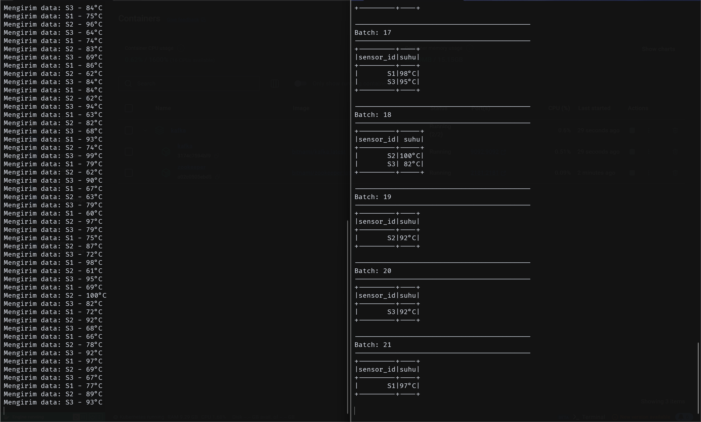

# Simple Kafka with Docker
- Steven Figo - 5027221021
- Sighra Attariq Sumerejati	- 5027221068

Proyek ini adalah contoh sederhana untuk menjalankan Apache Kafka menggunakan Docker. Proyek ini mencakup konfigurasi *Kafka* dan *Zookeeper* untuk menjalankan instance Kafka yang dapat diakses lokal untuk kebutuhan pengembangan.

## Menjalankan Kafka dengan Docker
1. Clone Repository

Clone proyek ini ke komputer lokal Anda:
```bash
git clone https://github.com/Derkora/simple-kafka.git
cd simple-kafka
```

2. Konfigurasi docker-compose.yml

File docker-compose.yml sudah berisi konfigurasi untuk Kafka dan Zookeeper.

3. Menjalankan Kafka

Untuk menjalankan Kafka, jalankan perintah berikut di terminal:

```bash
docker-compose up -d
```
Ini akan menjalankan Zookeeper dan Kafka di dalam kontainer Docker. Kafka akan tersedia di localhost:9092.

4. Memeriksa Status

Periksa apakah layanan berjalan dengan baik:
```bash
docker-compose ps
```

5. Menggunakan Kafka

Setelah Kafka berjalan, Anda bisa menggunakan Kafka producer dan consumer untuk mengirim dan menerima pesan.

- Membuat Topik

Jalankan perintah berikut untuk membuat topik baru bernama contoh-topic:
```bash
docker exec -it <nama_container_kafka> kafka-topics.sh --create --topic <contoh-topik> --bootstrap-server localhost:9092 --partitions 1 --replication-factor 1
```

- Mengirim Pesan

Untuk mengirim pesan menggunakan producer:

```bash
docker exec -it <nama_container_kafka> kafka-console-producer.sh --topic <contoh-topik> --bootstrap-server localhost:9092
```
Ketik pesan Anda, kemudian tekan Enter untuk mengirim.

- Menerima Pesan

Untuk menerima pesan menggunakan consumer:

```bash
docker exec -it <nama_container_kafka> kafka-console-consumer.sh --topic <contoh-topik> --bootstrap-server localhost:9092 --from-beginning
```

6. Mematikan Kafka

Untuk menghentikan Kafka dan Zookeeper:

```bash
docker-compose down
```

## Contoh Kode Python untuk Producer dan Consumer
Anda dapat menggunakan Python untuk membuat producer dan consumer. Pastikan Anda telah menginstal kafka-python sebelum melanjutkan.

- Menginstal Kafka Python:
```bash
pip install kafka-python
```

- Untuk membuat topik sensor-suhu dengan (nama_container_kafka = kafka)
```bash
docker exec -it kafka kafka-topics.sh --create --topic sensor-suhu --bootstrap-server localhost:9092 --partitions 1 --replication-factor 1
```

- Untuk memeriksa topik sudah dibuat atau belum
```bash
docker exec -it kafka kafka-topics.sh --list --bootstrap-server localhost:9092
```

### Menggunakan kode yang yang sudah disediakan
Jalankan producer di terminal baru:
```bash
python producer_sensor.py
```

Jalankan consumer di terminal baru:
```bash
python consumer_stream.py
```
Sekarang, producer akan mengirimkan data secara berkala ke topik sensor-suhu, dan consumer akan menerima dan menampilkan pesan tersebut.

## Hasil
